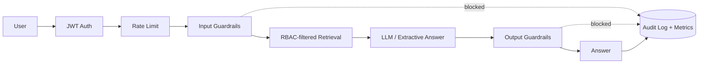

# Secure RAG with RBAC, Guardrails & Monitoring

A Retrieval-Augmented Generation (RAG) system where every answer respects **who is asking**.
Documents are filtered by the user's role *before* retrieval, requests and responses pass through
safety guardrails, and every query is logged for monitoring and auditing.


## Why this project?

A basic RAG app will happily answer from *any* document in its index, so a normal employee could
retrieve salary or finance data just by asking. This project shows how to build RAG that is
safe enough for internal company use:

- **Access control**: unauthorized text never reaches the LLM.
- **Guardrails**: block prompt injection, redact PII, and check that answers are grounded.
- **Observability**: metrics, structured logs and a full audit trail.

## Features

| Area | What it does |
|------|--------------|
| **RBAC** | JWT login, 5 roles, per-document access levels, filtering *before* retrieval |
| **Input guardrails** | Prompt-injection detection, blocked topics, query length limit, PII redaction (email, phone, CNIC, card) |
| **Output guardrails** | PII redaction, system-prompt leak check, grounding check against retrieved context |
| **Monitoring** | JSON structured logs, Prometheus-style `/metrics`, SQLite audit trail, per-user rate limiting |
| **RAG** | Chunking + TF-IDF retrieval (offline), optional Claude API for answer generation |

## Architecture



## Project Structure

```
rag_rbac/
├── app/
│   ├── main.py          # FastAPI routes
│   ├── pipeline.py      # End-to-end request flow
│   ├── rag.py           # Chunking, retrieval, answer generation
│   ├── rbac.py          # Users, roles, JWT
│   ├── guardrails.py    # Input & output guardrails
│   ├── monitoring.py    # Logs, metrics, audit, rate limit
│   └── config.py        # Settings
├── data/docs/           # Documents (first line: access level)
├── tests/               # Pytest suite
├── demo.py              # Run without a server
└── requirements.txt
```

## Quick Start

```bash
git clone https://github.com/<your-username>/secure-rag-rbac-guardrails.git
cd secure-rag-rbac-guardrails

python -m venv venv
source venv/bin/activate        # Windows: venv\Scripts\activate
pip install -r requirements.txt
```

**Run the demo (no server needed):**
```bash
python demo.py
```

**Run the API:**
```bash
uvicorn app.main:app --reload
```
Interactive docs: http://127.0.0.1:8000/docs

**Run tests:**
```bash
pytest -q tests
```

## Demo Users

| Username | Password | Role | Can access |
|----------|----------|------|------------|
| `admin` | `admin123` | admin | everything + audit log |
| `sara` | `hr123` | hr | public + HR documents |
| `ali` | `fin123` | finance | public + finance documents |
| `usman` | `eng123` | engineer | public + engineering documents |
| `guest` | `guest123` | employee | public documents only |

> These are demo credentials only. Replace them with a real user database in production.

## API Usage

**1. Login**
```bash
curl -X POST http://127.0.0.1:8000/login \
  -H "Content-Type: application/json" \
  -d '{"username": "sara", "password": "hr123"}'
```

**2. Ask a question**
```bash
curl -X POST http://127.0.0.1:8000/ask \
  -H "Authorization: Bearer <TOKEN>" \
  -H "Content-Type: application/json" \
  -d '{"query": "What is the salary band of a senior engineer?"}'
```

**Example response**
```json
{
  "answer": "Senior engineer PKR 350,000 to 550,000.",
  "status": "ok",
  "reason": "ok",
  "sources": ["hr_salary_bands.txt"]
}
```

The same question asked by `guest` returns *"I couldn't find that information in the documents
you have access to."*, because the HR document is never retrieved for that role.

| Endpoint | Method | Auth | Description |
|----------|--------|------|-------------|
| `/login` | POST | none | Returns a JWT |
| `/ask` | POST | Bearer | Ask a question |
| `/metrics` | GET | none | Prometheus-style metrics |
| `/admin/audit` | GET | admin | Recent audit records |
| `/health` | GET | none | Health check |

## How It Works

### RBAC
Each document starts with an access line:
```
access: hr
Salary bands: Junior engineer PKR 150,000 to 250,000 ...
```
Each role maps to a set of allowed levels (see `ROLE_PERMISSIONS` in `app/rbac.py`).
Chunks the user is not allowed to see are removed **before** similarity ranking.

### Guardrails
- **Input:** empty/oversized queries, prompt-injection patterns, blocked topics, PII redaction
- **Output:** PII redaction, system-prompt leak detection, grounding check (answer must overlap with retrieved context)

Blocked requests return a safe message and are recorded with a reason
(e.g. `prompt_injection`, `low_grounding`, `rate_limited`).

### Monitoring
- **Logs:** one JSON line per request (user, role, status, latency)
- **Metrics:** `rag_requests_total`, `rag_status_ok`, `rag_status_blocked`, `rag_no_context`,
  `rag_guard_input_*`, `rag_latency_ms_p50`, `rag_latency_ms_p95`
- **Audit:** every query stored in SQLite (`audit.db`), viewable by admins at `/admin/audit`

## Configuration

| Variable | Default | Description |
|----------|---------|-------------|
| `JWT_SECRET` | `change-me-in-production` | Secret for signing tokens (**set a long random value**) |
| `ANTHROPIC_API_KEY` | not set | Enables Claude for answer generation; otherwise an extractive fallback is used |
| `LLM_MODEL` | `claude-sonnet-4-6` | Model name used when the API key is set |
| `AUDIT_DB` | `audit.db` | Path of the audit database |

Other settings (`TOP_K`, `MIN_SCORE`, `MAX_QUERY_CHARS`, `RATE_LIMIT_PER_MIN`) live in `app/config.py`.

## Adding Your Own Documents

1. Create a `.txt` file in `data/docs/`
2. Make the first line `access: <level>` (`public`, `hr`, `finance`, `engineering`)
3. Restart the server; the index is rebuilt on startup

To add a new role or level, edit `ROLE_PERMISSIONS` in `app/rbac.py`.

## Limitations

- Guardrails are rule-based (regex), so they will not catch every attack.
- TF-IDF retrieval is keyword based; it does not understand synonyms.
- Users are stored in memory for demo purposes.
- Rate limiting and metrics are in-memory and reset on restart.

## Roadmap

- [ ] Semantic retrieval with `sentence-transformers` + FAISS/Chroma
- [ ] LLM-based guardrail classifier
- [ ] PDF / DOCX ingestion
- [ ] Streamlit chat UI and monitoring dashboard
- [ ] Database-backed users and Docker deployment

## License

MIT. See [LICENSE](LICENSE).
